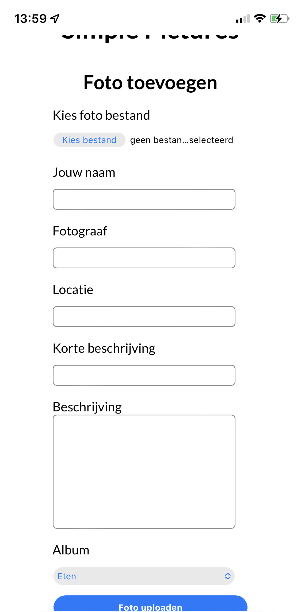
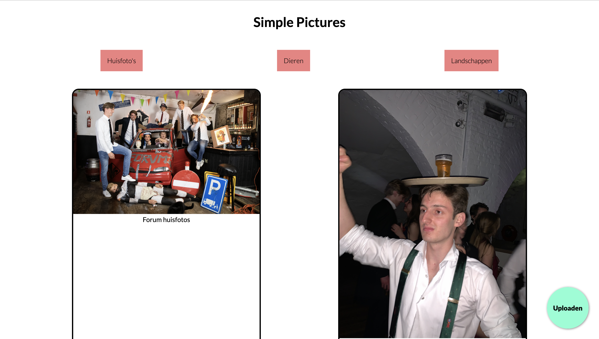

# Simple pictures

## The application

I made this application for the course browser technologies which is part of the minor Webdesign and development. The goal of the course is to make an application that can be used on all possible devices. For this application the site was tested on an iPod touch, my own iPhone (XS) and a firefox browser and chromium based browser. The application focuses on viewing photo albums and uploading pictures.

### Tested browsers

- iPod Touch
- Iphone 13
- Firefox browser on mac
- Chromium based browser on mac

### Screenshots

#### Mobile browser




#### Desktop browser




## Installation

To get this application working you can clone this repository.

install the application with `npm install`

after that you will have to create a directory in the public folder called pictures. The reason the folder is not included is because I thought it was inresponsible to upload pictures to github that aren't meant for an online presence.

After you have done it you can start the application with:

```cli
npm run start
```

or if you like using nodemon

```cli
npm run ndmStart
```

go to your localhost on port 5555. If you would like to use a different port it is possible to create a `.env` file and write `PORT= <YOUR PORT HERE>`. The application is now ready to be used.

## Tech stack

Application uses server side rendering running on

- Express server (to run the application)
- Pug rendering engine (rendering html)
- Multer (uploading files)
- UUID (creating unique id's)
- Body-Parser ( to read file uploads)

## Author

Application made by Remco Kuckelkorn

## License

MIT License.
